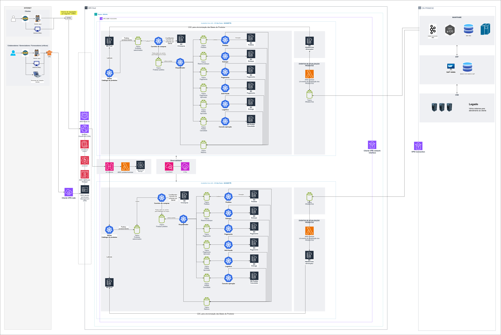

# Design de Arquiteturas 
Design de Arquitetura E-commerce - Trabalho acadêmico

Atualizado: 05/05/2024

# Pós-graduação em Arquitetura de Soluções - FIAP

Este trabalho propõe explorar a aplicabilidade do desenho de arquitetura de soluções na resolução de problemas reais. O foco será demonstrar como a arquitetura de soluções pode ser utilizada para identificar, analisar e solucionar desafios específicos dentro de um contexto empresarial ou tecnológico. O estudo incluirá caso prático onde o desenho de arquitetura foi fundamental para o sucesso do projeto, detalhando as metodologias e ferramentas utilizadas. Além disso, o trabalho abordará a importância da arquitetura de soluções como uma disciplina estratégica que contribui significativamente para a eficiência operacional e a inovação.

# Introdução

Nesta atividade, você aplicará os conhecimentos adquiridos na disciplina para projetar uma arquitetura para o desenvolvimento de uma arquitetura de soluções detalhada e demonstrar sua aplicabilidade na resolução de um problema real e específico enfrentado por uma organização ou setor no E-commerce.

# Objetivos

Desenvolver e documentar uma arquitetura de soluções detalhada para o setor de e-commerce, aplicando os conhecimentos teóricos e práticos adquiridos na disciplina. O objetivo é projetar uma solução que não apenas resolva um problema real e específico enfrentado por uma organização no setor de e-commerce, mas também demonstre a eficácia da arquitetura de soluções em facilitar operações comerciais, melhorar a experiência do cliente e impulsionar o crescimento empresarial. Este projeto buscará integrar tecnologias emergentes e práticas inovadoras para criar uma solução que seja sustentável, escalável e adaptável às mudanças do mercado e às necessidades dos consumidores.

# Expectativas

Este projeto de conclusão de curso representa um marco significativo na jornada educacional, onde a teoria encontra a prática. É uma chance única de aplicar os conhecimentos adquiridos durante o curso na criação de uma arquitetura de soluções inovadora, que visa endereçar e superar os desafios concretos enfrentados pelo setor de e-commerce.

Através deste projeto, não só consolidaremos nosso aprendizado acadêmico, mas também contribuiremos ativamente para o avanço do comércio eletrônico. A intenção é ir além do convencional, propondo soluções que sejam não apenas eficazes, mas também revolucionárias, capazes de transformar os paradigmas atuais do mercado.

Ao focar no e-commerce, um campo que está em constante evolução e expansão, temos a oportunidade de explorar uma variedade de tecnologias emergentes e estratégias de negócios. Este projeto será o alicerce para a construção de uma plataforma que não só atenda às necessidades imediatas dos consumidores e empresas, mas que também esteja preparada para se adaptar e prosperar diante das inevitáveis mudanças futuras do setor.

Em suma, este trabalho de conclusão é mais do que um exercício acadêmico; é uma contribuição real para um mundo cada vez mais digitalizado, onde o e-commerce desempenha um papel central na economia global. É uma chance de deixar uma marca indelével, propondo uma arquitetura que seja sinônimo de inovação, eficiência e sucesso.

# Aprendizado

No mundo do e-commerce, a arquitetura de soluções é essencial para criar uma plataforma que não só atenda às expectativas dos consumidores, mas também se destaque em um mercado competitivo. Uma arquitetura bem projetada é a espinha dorsal de qualquer operação de comércio eletrônico bem-sucedida, garantindo que a experiência do usuário seja suave e agradável desde o momento em que entram na loja virtual até o checkout e além.

Para isso, a experiência do usuário deve ser prioridade. Isso significa que a navegação deve ser intuitiva, as páginas devem carregar rapidamente e o processo de compra deve ser o mais simples possível. Personalização avançada, baseada em inteligência artificial, pode ajudar a criar uma experiência única para cada cliente, sugerindo produtos que eles provavelmente gostarão e oferecendo ofertas personalizadas.

A segurança é outra pedra angular. Com as crescentes preocupações sobre a privacidade de dados e fraudes online, garantir que as transações sejam seguras e que os dados dos clientes estejam protegidos é fundamental. Isso pode ser alcançado através da implementação de protocolos de segurança robustos e da conformidade com as regulamentações de proteção de dados.

Além disso, a escalabilidade é crucial. À medida que o negócio cresce, a plataforma de e-commerce deve ser capaz de se adaptar a um maior volume de vendas e tráfego sem comprometer o desempenho. Isso requer uma infraestrutura que possa escalar rapidamente para atender à demanda, seja através de soluções em nuvem ou de tecnologias de computação distribuída.

Por fim, a integração eficiente de sistemas é o que permite que todas as peças do quebra-cabeça do e-commerce se encaixem. Isso inclui a sincronização com sistemas de gestão de estoque, processamento de pagamentos e logística de entrega. Uma arquitetura que promove a integração suave entre esses sistemas pode significar a diferença entre uma operação eficiente e uma que está constantemente lidando com gargalos.

Integrar tecnologias emergentes é como colocar o turbo em uma máquina já bem-oleada. Por exemplo, a análise de big data pode fornecer insights valiosos sobre o comportamento do consumidor, enquanto a blockchain pode oferecer novas maneiras de garantir a autenticidade dos produtos e a segurança das transações. A Internet das Coisas (IoT) pode revolucionar a logística, e a computação em nuvem pode oferecer a flexibilidade necessária para inovar rapidamente.

Em resumo, uma arquitetura de soluções para e-commerce deve ser segura, escalável, integrada e inovadora, garantindo que a plataforma não apenas atenda às necessidades atuais, mas também esteja preparada para o futuro. É um equilíbrio delicado entre tecnologia, negócios e design de experiência do usuário, mas quando feito corretamente, pode levar o e-commerce a novas alturas.

# Que perguntas precisamos que sejam respondidas?

* Quais estratégias de arquitetura maximizam a eficiência operacional e a satisfação do cliente?
* Como podemos garantir a escalabilidade e a sustentabilidade das soluções de e-commerce?
* Como a integração de sistemas de gestão de relacionamento com o cliente (CRM) e planejamento de recursos empresariais (ERP) pode otimizar as operações de e-commerce e melhorar a tomada de decisão?
* De que maneira as tecnologias de inteligência artificial podem ser aplicadas para personalizar a experiência do usuário e aumentar as taxas de conversão em plataformas de e-commerce?
* Quais são os desafios e soluções para manter a segurança dos dados do cliente em meio à crescente ameaça de ataques cibernéticos no e-commerce?
* Como as práticas de sustentabilidade podem ser incorporadas na arquitetura de e-commerce para promover responsabilidade ambiental e social?
* Como a decisão entre utilizar mainframes (alta plataforma) e soluções baseadas em cloud (baixa plataforma) afeta a escalabilidade, a segurança e a inovação tecnológica em uma operação de e-commerce?
* Quais são os desafios e as melhores práticas para integrar mainframes tradicionais e infraestruturas de cloud computing, a fim de otimizar a eficiência e a inovação em operações de e-commerce?
* Qual é o impacto financeiro da integração de mainframes e infraestruturas de cloud computing no orçamento operacional de uma empresa de e-commerce, e como otimizar o custo-benefício dessa integração?
* Quais podem ser as repercussões operacionais e estratégicas para uma empresa de e-commerce que não leva em conta os custos de integração entre mainframes e infraestruturas de cloud computing?

# Quais são os nossos principais riscos?

* Dificuldades na integração de sistemas legados com novas tecnologias de cloud;
* Vulnerabilidades que podem ser exploradas durante a transição de dados entre mainframes e cloud;
* Falta de conhecimento especializado para gerenciar e manter ambas as plataformas;
* Necessidade de atender a diferentes regulamentações de dados em ambientes de mainframe e cloud;
* Flutuações inesperadas nos custos devido à volatilidade dos preços dos serviços de cloud;
* Risco de downtime durante a migração ou integração de dados;
* Atrasos na transferência de dados que afetam a performance do e-commerce;
* Riscos associados à confiança excessiva em um único provedor de cloud;
* Desafios em escalar operações de maneira eficiente ao integrar mainframes com cloud;
* Uso inadequado de recursos de cloud, resultando em custos elevados;
* Aumento da complexidade na gestão de duas plataformas distintas;
* Problemas de compatibilidade de software entre mainframes e aplicações de cloud;
* Perda ou corrupção de dados durante a transferência entre plataformas;
* Despesas não previstas relacionadas à manutenção e atualização de sistemas integrados;
* Complicações na implementação de estratégias de backup e recuperação de dados;
* Queda no desempenho do sistema devido à complexidade da integração;
* Implicações legais devido ao armazenamento e processamento de dados em diferentes jurisdições;
* Risco de os mainframes se tornarem obsoletos mais rapidamente devido ao avanço da cloud;
* Resistência interna à mudança para novas tecnologias de cloud;
* Decisões estratégicas equivocadas devido à falta de clareza sobre as vantagens e desvantagens de cada plataforma.

# Crie um plano para aprender o que precisamos para responder a perguntas específicas

*  Iniciar com reuniões detalhadas com o cliente para compreender profundamente o modelo de negócio, os processos operacionais, as expectativas e os objetivos específicos do projeto de e-commerce;
*  Coletar e analisar os requisitos técnicos e de negócios, incluindo funcionalidades desejadas, integrações necessárias, expectativas de desempenho e requisitos de segurança;
*  Realizar uma pesquisa de mercado para identificar tendências emergentes no e-commerce, tecnologias inovadoras e práticas recomendadas que podem ser aplicadas ao projeto;
*  Revisar os riscos identificados anteriormente e realizar uma nova avaliação de riscos com base no contexto atual do cliente, considerando fatores como mudanças tecnológicas, regulamentações e comportamento do consumidor;
*  Comparar soluções semelhantes no mercado, identificando pontos fortes e fracos que podem informar o desenho da solução;
*  Organizar workshops com todas as partes interessadas para alinhar visões, coletar feedback e garantir que todos os requisitos e preocupações estejam sendo considerados;
*  Desenvolver protótipos rápidos ou maquetes para validar ideias e conceitos com o cliente e os usuários finais, permitindo ajustes ágeis antes do desenvolvimento completo;
*  Consultar com outros arquitetos de soluções e especialistas técnicos para revisar o desenho proposto, buscando feedback e sugestões de melhorias;
*  Criar um plano de implementação que detalhe cada etapa do processo, desde o desenvolvimento até o lançamento, incluindo cronogramas, recursos necessários e métricas de sucesso;
*  Assegurar que toda a documentação do projeto seja completa e esteja atualizada, incluindo especificações técnicas, desenhos arquitetônicos e manuais de operação;
*  Definir uma estratégia de testes abrangente que cubra todos os aspectos da solução, desde testes unitários até testes de aceitação do usuário;
*  Desenvolver planos de contingência para lidar com possíveis problemas durante a implementação, incluindo falhas técnicas, atrasos no cronograma e questões de conformidade.

# Crie um plano para reduzir riscos.

*  Realizar uma análise de riscos completa para cada aspecto da integração, priorizando-os com base em sua probabilidade e impacto potencial;
* Desenvolver estratégias de mitigação específicas para cada risco identificado, incluindo planos de ação e recursos necessários para a implementação;
* Investir na modernização dos mainframes e na adoção de tecnologias de cloud mais recentes para garantir compatibilidade e segurança;
* Providenciar treinamento contínuo para a equipe em tecnologias de mainframe e cloud, focando em práticas de segurança e manutenção;
* Implementar medidas de segurança avançadas, como criptografia de ponta a ponta, autenticação multifator e firewalls robustos;
* Estabelecer um sistema de monitoramento em tempo real para detectar e responder a ameaças de segurança rapidamente;
* Conduzir testes abrangentes, incluindo testes de penetração e simulações de ataque, para avaliar a robustez da integração;
* Implementar soluções de backup e recuperação de dados robustas para garantir a continuidade do negócio em caso de falhas;
* Diversificar os fornecedores de cloud e negociar acordos de nível de serviço (SLAs) que incluam garantias de desempenho e segurança;
* Monitorar e otimizar continuamente o uso de recursos de cloud para evitar gastos excessivos e desperdício.
* Manter documentação detalhada de todos os sistemas e processos e garantir a conformidade com as regulamentações relevantes;
* Manter uma comunicação clara e regular com todas as partes interessadas para alinhar expectativas e reportar progressos;
* Desenvolver e testar um plano de resposta a incidentes para lidar eficientemente com qualquer violação de segurança ou interrupção do serviço;
* Realizar revisões periódicas da arquitetura de soluções para identificar e corrigir vulnerabilidades e garantir que as práticas recomendadas estejam sendo seguidas;
* Fomentar uma cultura de segurança dentro da organização, onde todos os funcionários estejam cientes de suas responsabilidades na proteção dos sistemas;
* Projetar a arquitetura com flexibilidade para se adaptar a mudanças tecnológicas e escalabilidade para suportar o crescimento do negócio;
* Realizar uma BIA para entender o impacto potencial de diferentes riscos nos processos de negócios e na linha de fundo;
* Contratar auditores externos para avaliar a segurança e a eficácia da integração de mainframes e cloud;
* Executar simulações de crise para testar a resiliência da organização e a eficácia dos planos de contingência;
* Estabelecer um processo de feedback contínuo para aprender com os incidentes e melhorar constantemente as práticas de segurança e gestão de riscos.

# Quem são as partes interessadas?

* Os indivíduos ou entidades que possuem o negócio de e-commerce;
* Usuários finais que compram produtos ou serviços através da plataforma de e-commerce;
* Inclui o arquiteto de soluções, desenvolvedores, designers de UX/UI, e gerentes de projeto responsáveis pela construção e implementação do e-commerce;
* Empresas ou indivíduos que fornecem produtos ou serviços para serem vendidos na plataforma de e-commerce;
* Empresas de transporte e logística que gerenciam a entrega de produtos aos clientes;
* Profissionais responsáveis pela promoção da plataforma de e-commerce e atração de clientes;
* Pessoal encarregado de ajudar os clientes com dúvidas, problemas ou devoluções;
* Especialistas em segurança responsáveis por proteger o site de e-commerce contra ameaças cibernéticas;
* Indivíduos ou entidades que financiam o projeto de e-commerce esperando um retorno sobre o investimento;
* Autoridades governamentais ou órgãos reguladores que estabelecem normas para o comércio eletrônico;
* Fornecedores de soluções de software e hardware que apoiam a infraestrutura do e-commerce.

# O que as partes interessadas esperam ganhar?

As partes interessadas em um projeto de e-commerce têm uma variedade de expectativas, todas centradas no sucesso e na viabilidade do projeto. Os proprietários de negócios esperam que a plataforma gere lucro, aumente a base de clientes e solidifique a presença da marca no mercado digital. Para os clientes, a expectativa é de uma experiência de compra segura, conveniente e personalizada, que ofereça uma ampla seleção de produtos e um processo de checkout sem complicações.

A equipe de projeto, que inclui o arquiteto de soluções, desenvolvedores e designers, busca a satisfação de criar uma plataforma robusta e inovadora que atenda ou exceda os padrões técnicos e as necessidades do usuário. Eles também esperam reconhecimento profissional e oportunidades de crescimento a partir do sucesso do projeto.

Os fornecedores visam aumentar suas vendas e expandir seu alcance de mercado através de uma parceria bem-sucedida com a plataforma de e-commerce. Parceiros de logística, por sua vez, buscam eficiência operacional e contratos lucrativos que possam resultar de um sistema de entrega otimizado.

A equipe de marketing espera que suas estratégias atraiam tráfego significativo para o site e convertam visitantes em clientes fiéis, enquanto a equipe de suporte ao cliente deseja fornecer um serviço excepcional que melhore a satisfação do cliente e a reputação da empresa.

Especialistas em segurança de TI estão focados em proteger a plataforma contra ameaças cibernéticas, garantindo a confiança dos usuários na segurança de suas transações e dados. Investidores, naturalmente, estão interessados no retorno financeiro sobre seu investimento e no crescimento a longo prazo do negócio.

Reguladores esperam que a plataforma opere dentro dos parâmetros legais e cumpra todas as regulamentações pertinentes, enquanto parceiros tecnológicos buscam estabelecer relações duradouras e lucrativas, fornecendo soluções que impulsionem o sucesso do e-commerce.

Em resumo, cada parte interessada tem um conjunto único de expectativas, mas todos compartilham um objetivo comum: o sucesso contínuo e a evolução do projeto de e-commerce, que beneficia não apenas a empresa, mas também a comunidade mais ampla de usuários e colaboradores.

# Quem são os usuários?

Os usuários de um produto de e-commerce, que inclui lojas virtuais, sistemas e mainframes, são bastante diversificados, refletindo a ampla gama de interações possíveis com a plataforma. Aqui estão alguns dos principais tipos de usuários:

* Indivíduos que visitam a loja virtual para navegar e comprar produtos ou serviços. Eles são o foco principal do design da experiência do usuário (UX) e da interface do usuário (UI);
* Empresas ou indivíduos que utilizam a plataforma para vender seus produtos ou serviços. Eles precisam de ferramentas para gerenciar inventário, pedidos e relacionamento com os clientes;
* Pessoal que gerencia a operação diária da loja online, incluindo gerenciamento de conteúdo, processamento de pedidos e atendimento ao cliente;
* Profissionais que mantêm a infraestrutura tecnológica da loja virtual, incluindo servidores, bancos de dados e integrações de sistemas. Eles podem trabalhar diretamente com mainframes e sistemas de back-end;
* Especialistas que coletam e analisam dados de vendas, tráfego e comportamento do usuário para informar decisões de negócios e estratégias de marketing;
* Especialistas encarregados de promover a loja virtual e otimizar a visibilidade nos motores de busca;
* Responsáveis por proteger a plataforma contra ameaças digitais e garantir a segurança das transações e dos dados dos usuários;
* Pessoal que fornece assistência e suporte aos usuários da loja virtual, ajudando com questões técnicas ou relacionadas a produtos;
* Tomadores de decisão que usam informações do sistema para planejar e executar estratégias de negócios;
* Profissionais que garantem que a loja virtual esteja em conformidade com as leis e regulamentos aplicáveis.

Cada um desses usuários interage com diferentes aspectos do sistema de e-commerce e tem necessidades específicas que devem ser atendidas para garantir uma operação eficiente e bem-sucedida da plataforma.

# O que eles estão tentando realizar?

Resumidamente, as partes interessadas em um projeto de e-commerce estão tentando realizar o seguinte:

 *  Maximizar lucros, expandir a base de clientes e fortalecer a marca.
 *  Ter uma experiência de compra online segura, conveniente e personalizada.
 *  Desenvolver uma plataforma que seja tecnicamente avançada e que ofereça uma ótima experiência ao usuário.
 *  Aumentar vendas e alcançar novos mercados.
 *  Garantir entregas eficientes e pontuais.
 *  Atrair e reter clientes, aumentando a visibilidade e as vendas.
 *  Fornecer um atendimento ao cliente excepcional.
 *  Proteger a plataforma contra ameaças digitais.
 *  Obter um retorno financeiro sobre o investimento.
 *  Assegurar que a plataforma esteja em conformidade com as leis e regulamentos.
 *  Estabelecer relações comerciais duradouras e lucrativas.

Cada grupo está focado em alcançar seus objetivos específicos, que contribuem para o sucesso geral do projeto de e-commerce.

# Qual o pior que pode acontecer?

Considerando um arquiteto de soluções muito experiente trabalhando em um projeto de e-commerce, os piores cenários que podem acontecer incluem:

* Violações de dados que resultam em perda de informações confidenciais do cliente;
* Incapacidade de escalar a infraestrutura para lidar com picos de tráfego, levando a tempos de carregamento lentos e potencial inatividade do site;
* Falhas na integração de sistemas críticos como gestão de estoque, processamento de pagamentos e logística, causando erros operacionais e atrasos na entrega;
* Navegação complicada, checkout demorado ou personalização ineficaz que pode frustrar os usuários e aumentar as taxas de abandono do carrinho;
* Orçamentos subestimados ou gastos excessivos que ultrapassam os recursos financeiros alocados para o projeto;
* Expansão do escopo do projeto além dos limites originais sem ajustes adequados de tempo e recursos.
* Problemas com a arquitetura de software, como bugs ou incompatibilidades, que afetam a funcionalidade do e-commerce;
* Não conformidade com regulamentações de proteção de dados e privacidade, resultando em penalidades legais.
* Adoção de tecnologias que rapidamente se tornam desatualizadas, exigindo substituições custosas e frequentes;
* Dificuldade em adotar novas práticas ou tecnologias devido à resistência interna ou à cultura organizacional.

Esses riscos destacam a importância de uma gestão de riscos proativa e de uma abordagem de design centrada no usuário para garantir o sucesso do projeto de e-commerce.

# Desenhe uma arquitetura

